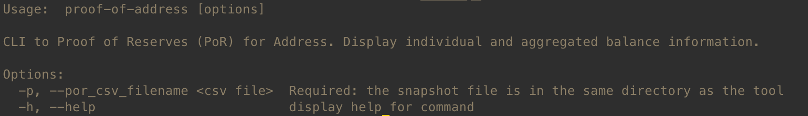

# Huobi Verify Address

## Background

Huobi launches [Proof of Reserves (PoR)]() to improve the security and transparency of user's assets. These tools will allow
you to independently audit Huobi's Proof of Reserves, verify all Huobi's reserves addresses known liabilities to
users, in order to confirm the solvency of Huobi.

## Introduction

### Building the source

Download the [latest build](https://github.com/huobiapi/Tool-Node.js-VerifyAddress/releases) for your operating system and architecture. Also, you can build the source by yourself.

Building this open source tool requires Node.js (version >= 14.20.0).

Install dependencies
```shell
 npm install 
```

build
```shell
npm run build
```

test
```shell
npm test
```

compile
```shell
npm run compile
```

### Executable

Proof-of-Reserves executable are in the cmd directory

|    Command    | Description                                                                                                                                                                     |
| :-----------: |---------------------------------------------------------------------------------------------------------------------------------------------------------------------------------|
|   `VerifyAddress`    | We have signed a specific message with a private key to each address published by Huobi. This tool can be used to verify Huobi's signature and verify Huobi's ownership of the address. |

## Reserves

Download Huobi's [Proof of Reserves File](), verify the ownership of the Huobi's public address [Details here]()

### VerifyAddress

Huobi's public file contains address, message "King will be back!" and signature. You can use VerifyAddress to verify
Huobi's ownership of published address.

How to use?

```shell
./VerifyAddress --help
```



Verify address example:
```shell
./VerifyAddress --por_csv_filename ./huobi_por_xxxxyyzz.csv
```

The result like below:


### VerifyOnline

At the same time, you can use third-party tools to verify the ownership.
- [BTC single addresses](https://www.bitcoin.com/tools/verify-message/)
- [EVM](https://etherscan.io/verifiedsignatures)
- [TRX addresses](https://tronscan.org/#/tools/verify-sign)
